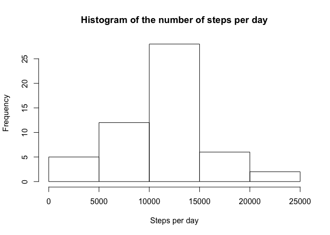
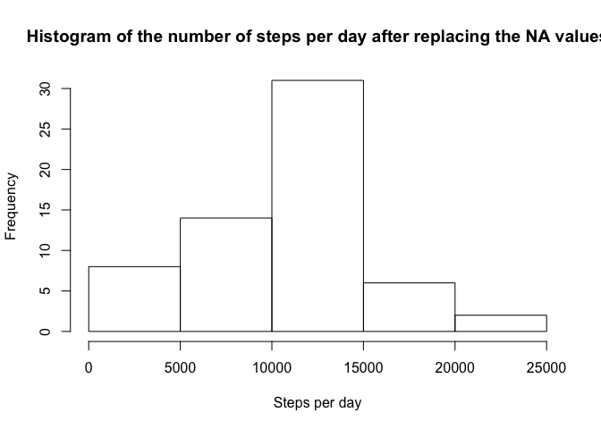
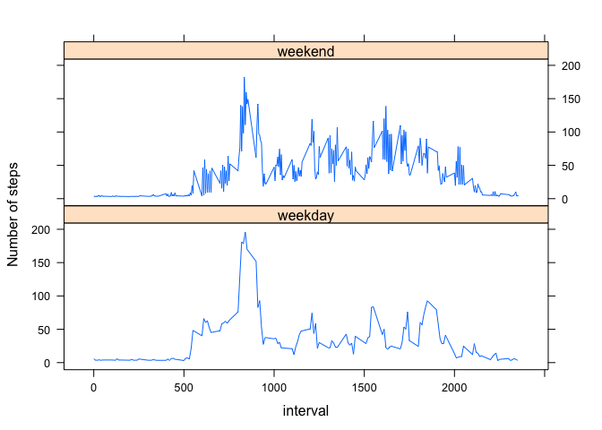

# Reproducible Research: Peer Assessment 1
Change how numbers are being printed inline by knitr and make sure dates are shown in English:

```r
options(scipen = 5, digits = 7)
Sys.setlocale(locale = "en_US.UTF-8")
```

```
## [1] "en_US.UTF-8/en_US.UTF-8/en_US.UTF-8/C/en_US.UTF-8/C"
```

## Loading and preprocessing the data

```r
myData <- read.csv(unz("activity.zip", "activity.csv"), header = TRUE)
myData$date2 = strptime(myData$date, "%Y-%m-%d")
```


## What is mean total number of steps taken per day?

```r
stepsPerDay <- aggregate(steps ~ date, data=myData, sum)
hist(stepsPerDay$steps, xlab = "Steps per day", main="Histogram of the number of steps per day")
```

 

```r
meanStepsPerDay <- mean(stepsPerDay$steps)
medianStepsPerDay <- median(stepsPerDay$steps)
```
According to the histogram, there were between 10.000 and 15.000 steps on most days.

The mean is 10766.1886792  and the median is 10765.

## What is the average daily activity pattern?

```r
stepsPer5MinInterval = aggregate(steps ~ interval, data=myData, mean)
plot(stepsPer5MinInterval, type="l")
```

 

The following interval has the most steps on average:


```r
stepsPer5MinInterval[which.max(stepsPer5MinInterval$steps), ]
```

```
##     interval    steps
## 104      835 206.1698
```

## Inputting missing values
Calculate the number of rows with NA values:

```r
myDataNA = subset(myData, is.na(steps))
nrow(myDataNA)
```

```
## [1] 2304
```
Find the mean value of neighbouring values and use that to replace the NA values:

```r
myDataBackup <- myData
for (indexOfNaValue in which(is.na(myData$steps))) {
  meanValueOfNeighbours = mean(myData$steps[(max(0,indexOfNaValue-400)):(indexOfNaValue+400)], na.rm = TRUE)
  myData$steps[indexOfNaValue] <- meanValueOfNeighbours
}
```
Make a histogram of the total number of steps taken each day and Calculate and report the mean and median total number of steps taken per day.

```r
stepsPerDayWithoutNA <- aggregate(steps ~ date, data=myData, sum)
hist(stepsPerDayWithoutNA$steps, xlab = "Steps per day", main="Histogram of the number of steps per day after replacing the NA values")
```

 

```r
meanStepsPerDayWithoutNA <- mean(stepsPerDayWithoutNA$steps)
medianStepsPerDayWithoutNA <- median(stepsPerDayWithoutNA$steps)
```
According to the histogram, there were between 10.000 and 15.000 steps on most days.

The mean is 10336.19424  and the median is 10600. Before we replaced the NA values, the mean was 10766.1886792 and the median was 10765. The values clearly were impacted by the algorithm that was used to replace NA values.


## Are there differences in activity patterns between weekdays and weekends?
Create the factor variable 'daytype': 

```r
myData$daytype <- factor(c("weekday", "weekend"))
myData$daytype[which(weekdays(myData$date2)=="Saturday")] <- "weekend"
myData$daytype[which(weekdays(myData$date2)=="Sunday")] <- "weekend"
```

Make a panel plot containing a time series plot (i.e. type = "l") of the 5-minute interval (x-axis) and the average number of steps taken, averaged across all weekday days or weekend days (y-axis):

```r
stepsPer5MinIntervalPerDayType = aggregate(steps ~ interval+daytype, data=myData, mean)
library(lattice)
xyplot(steps~interval|daytype, data=stepsPer5MinIntervalPerDayType, type="l", layout=c(1,2), ylab="Number of steps")
```

 
